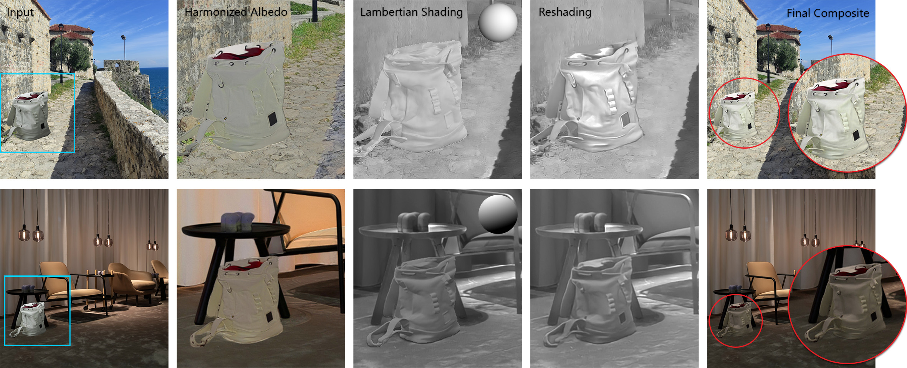
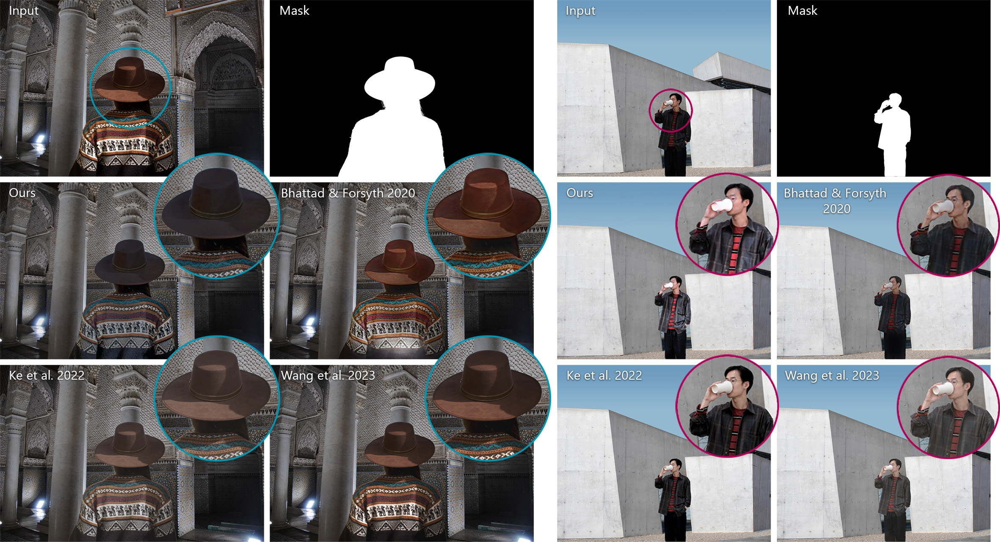

# Intrinsic Harmonization for Illumination-Aware Compositing
Code for the paper: Intrinsic Harmonization for Illumination-Aware Compositing, [Chris Careaga](https://ccareaga.github.io), [S. Mahdi H. Miangoleh](https://miangoleh.github.io) [Yağız Aksoy](https://yaksoy.github.io), Proc. SIGGRAPH Asia, 2023 
### [Project Page](https://yaksoy.github.io/intrinsicCompositing) | [Paper](https://yaksoy.github.io/papers/SigAsia23-IntrinsicCompositing.pdf) | [Video](https://www.youtube.com/watch?v=M9hCUTp8bo4) | [Supplementary](https://yaksoy.github.io/papers/SigAsia23-IntrinsicCompositing-Supp.pdf)

We propose an illumination-aware image harmonization approach for in-the-wild imagery. Our method is formulated in the intrinsic image domain. We use off-the-shelf networks to generate albedo, shading and surface normals for the input composite and background image. We first harmonize the albedo of the background and foreground by predicting image editing parameters. Using normals and shading we estimate a simple lighting model for the background illumination. With this lighting model, we render Lambertian shading for the foreground and refine it using a network trained on segmentation datasets via self-supervision. When compared to prior works we are the only method that is capable of modeling realistic lighting effects.

[](https://www.youtube.com/watch?v=M9hCUTp8bo4)


## Method
Compositing is a crucial image editing task requiring realistic integration of objects into new backgrounds. 
Achieving a natural composition requires adjusting the appearance of the inserted object through a process called image harmonization. 
While existing literature addresses color harmonization, relighting, an equally vital aspect, is often overlooked due to the challenges in realistically adjusting object illumination in diverse environments.


In this project, we tackle image harmonization in the intrinsic domain, decomposing images into reflectance (albedo) and illumination (shading). 
We employ a two-step approach: first, harmonizing color in the albedo space, and then addressing the challenging relighting problem in the shading domain. 
Our goal is to generate realistic shading for the composited object, reflecting the new illumination environment. 


More specifically, we initially render an initial shading using the Lambertian model and surface normals for the background and inserted object. 
A re-shading network then refines this shading for the composited object in a self-supervised manner.
Our method is able to generate novel reshadings of the foreground region that reflect the illumination conditions of the background scene.



Our method outperforms prior works, producing realistic composite images that not only match color but also exhibit realistic illumination in diverse scenarios.



Our re-shading network learns to predict spatially-varying lighting effects in-context due to our self-supervised training approach


## Setup
Depending on how you would like to use the code in this repository there are two options to setup the code.
In either case, you should first create a fresh virtual environment (`python3 -m venv intrinsic_env`) and start it (`source intrinsic_env/bin/activate`)

You can install this repository as a package using `pip`:
```
git clone https://github.com/compphoto/IntrinsicCompositing
cd IntrinsicCompositing
pip install .
```
If you want to make changes to the code and have it reflected when you import the package use `pip install --editable`
Or perform the same action without cloning the code using:
```
pip install https://github.com/compphoto/IntrinsicCompositing/archive/main.zip
```
This will allow you to import the repository as a Python package, and use our pipeline as part of your codebase.

## Interface

The best way to run our pipeline is by using our interactive interface. We provide some example backgrounds and foregrounds in `interface/examples`:

```
$ cd interface
$ python interface.py --bg examples/bgs/lamp.jpeg --fg examples/fgs/soap.png --mask examples/masks/soap.png
```
The first time you run the interface multiple pretrained checkpoints will be downloaded (the method makes use of multiple off-the-shelf models) which may take some time. Subsequent runs will use the cached weights, but there is still a bit of preprocessing that is required when the interface is started. Once the preprocessing is done the interface window will appear and the input composite can be edited. After editing the composite, harmonizing only requires running our albedo and shading networks which should only take a second or two. These are the keybinds for the interface:

| Key | Action |
|--|--|
| r | run the harmonization of the current composite |
| s | save inputs, outputs and intermediate images |
|1-5 | view various intermediate representations (shading, normals, etc) |
|scroll up/down | scale foreground region up or down |

The interface has been tested on an RTX2060 with 8 gb of VRAM which should be able to handle inference at a 1024 pixel resolution. 

## Inference

If you want to run our pipeline on pre-made composite images, you can use the script in the `inference` folder. 
This script will iterate through a set of composites and output our harmonized result:
```
$ cd inference
$ python inference.py --help

usage: inference.py [-h] --input_dir INPUT_DIR --output_dir OUTPUT_DIR [--inference_size INFERENCE_SIZE] [--intermediate]

optional arguments:
  -h, --help            show this help message and exit
  --input_dir INPUT_DIR
                        input directory to read input composites, bgs and masks
  --output_dir OUTPUT_DIR
                        output directory to store harmonized composites
  --inference_size INFERENCE_SIZE
                        size to perform inference (default 1024)
  --intermediate        whether or not to save visualization of intermediate representations

```
Here is how you can run the script on a set of example composites stored in `inference/examples`:
```
$ python inference.py --input_dir examples/ --output_dir output/
```
If you want to test your own examples, the script uses the following input directory structure:
```
examples/
├── cone_chair
│   ├── bg.jpeg
│   ├── composite.png
│   └── mask.png
├── lamp_candles
│   ├── bg.jpeg
│   ├── composite.png
│   └── mask.png
└── lamp_soap
    ├── bg.jpeg
    ├── composite.png
    └── mask.png
```
Each directory contains a composite image, a corresponding mask for the composited region, and the background image without the composited object. 
Note the background image is only used to compute the lighting direction, so it doesn't need to be exactly aligned with the composite image.
In fact, it can be any image and the script will use it to estimate the illumination parameters used as part of our pipeline.

The script expects the images to have the extensions shown above, and for the bg and composite to be three channels while the mask is one channel.
The script can be easily adjusted in order to fit whatever data format you're using.

## Citation

```
@INPROCEEDINGS{careagaCompositing,  
	author={Chris Careaga and S. Mahdi H. Miangoleh and Ya\u{g}{\i}z Aksoy},  
	title={Intrinsic Harmonization for Illumination-Aware Compositing},  
	booktitle={Proc. SIGGRAPH Asia},  
	year={2023},  
}
```

## License

This implementation is provided for academic use only. Please cite our paper if you use this code or any of the models. 

The methodology presented in this work is safeguarded under intellectual property protection. For inquiries regarding licensing opportunities, kindly reach out to SFU Technology Licensing Office &#60;tlo_dir <i>ατ</i> sfu <i>δøτ</i> ca&#62; and Dr. Yağız Aksoy &#60;yagiz <i>ατ</i> sfu <i>δøτ</i> ca&#62;.
